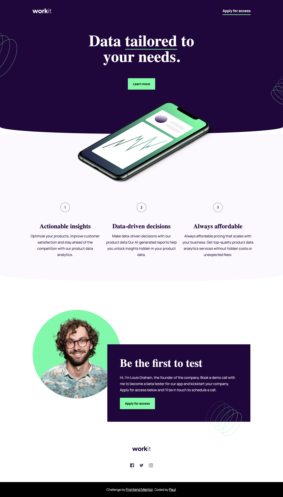

# Frontend Mentor - Workit landing page solution

This is a solution to the [Workit landing page challenge on Frontend Mentor](https://www.frontendmentor.io/challenges/workit-landing-page-2fYnyle5lu). Frontend Mentor challenges help you improve your coding skills by building realistic projects. 

## Table of contents

- [Overview](#overview)
  - [The challenge](#the-challenge)
  - [Screenshot](#screenshot)
  - [Links](#links)
- [My process](#my-process)
  - [Built with](#built-with)
  - [Continued development](#continued-development)
  - [Useful resources](#useful-resources)
- [Author](#author)
- [Acknowledgments](#acknowledgments)

**Note: Delete this note and update the table of contents based on what sections you keep.**

## Overview

### The challenge

Users should be able to:

- View the optimal layout for the interface depending on their device's screen size
- See hover and focus states for all interactive elements on the page

### Screenshot

### Links

- Solution URL: [https://github.com/hatealgebra/workit-landing-page-FEM](https://github.com/hatealgebra/workit-landing-page-FEM)
- Live Site URL: [https://workit-lp-fem-pv.netlify.app](https://workit-lp-fem-pv.netlify.app)

### Built with

- Semantic HTML5 markup
- SASS
- Parcel for bundling

## Author

- Website - [Pavel Vondra](https://www.pavel-vondra.com)
- Frontend Mentor - [@hatealgebra](https://www.frontendmentor.io/profile/hatealgebra)